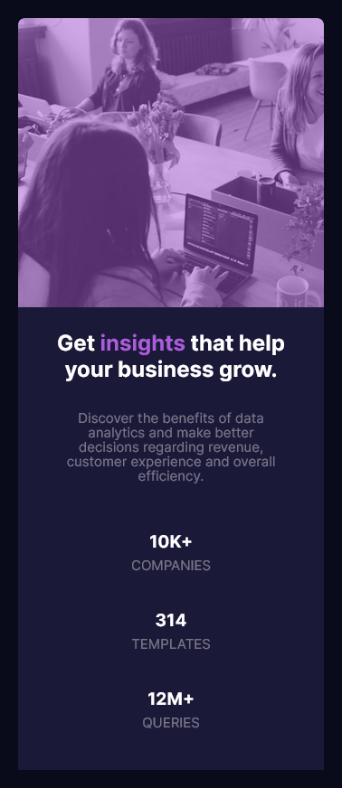

# Frontend Mentor - Stats preview card component solution by Prisca.

This is a solution to the [Stats preview card component challenge on Frontend Mentor](https://www.frontendmentor.io/challenges/stats-preview-card-component-8JqbgoU62). Frontend Mentor challenges help you improve your coding skills by building realistic projects. 

## Table of contents

- [Overview](#overview)
  - [The challenge](#the-challenge)
  - [Screenshot](#screenshot)
  - [Links](#links)
- [My process](#my-process)
  - [Built with](#built-with)
  - [What I learned](#what-i-learned)
  - [Continued development](#continued-development)

- [Author](#author)
- [Acknowledgments](#acknowledgments)

**Note: Delete this note and update the table of contents based on what sections you keep.**

## OVERVIEW
This was a fun project generally, took me an average of 3hrs 30mins to complete.


### The challenge
Users should be able to:

- View the optimal layout depending on their device's screen size


### Screenshot




### Links
- Solution URL: [Add solution URL here](https://github.com/PriscaTonia/frontendMentors-challenge-1)
- Live Site URL: [Add live site URL here](https://frontend-mentors-challenge-1.vercel.app/)


## MY PROCESS
So for my process, I started by setting up my HTML file and CSS file, then I got the necessary fonts from Google fonts, and then I tried to map out an algorithm for the tasks, and i started building :)


### Built with
- Semantic HTML5 markup
- CSS custom properties
- Flexbox
- CSS Grid
- Desktop-first workflow


### What I learned
Okay, so for this project, I practiced styling section by section. What I mean by this is for example, after creating a div, I give that div its required styles.
This method was a bit slow in the begining, but when I got a hang of it, it was okay.
It also made the task easier to complete, why? Because I didn't have to finish writing all of my HTML codes, and then start styling, if I had done that, I'm sure I would have taken more time.


```css
.proud-of-this-css {
  display: flex;
  background-image: url(images/image-header-desktop.jpg);
  /* especially this one here, this allowed me to add the overlay in the background image. */
  box-shadow: inset 0 0 0 2000px hsla(277, 64%, 61%, 0.3);  
  background-repeat: no-repeat;
  background-size: cover;
  border-radius: 0 8px 8px 0;
}
```


### Continued development
I would love to learn more on how to be more flexible with grids and flexboxes as I work on more projects.


## AUTHOR
- Website - [Add your name here](Onwudebelu Prisca Anthonia)
- Frontend Mentor - [@yourusername](https://www.frontendmentor.io/profile/PriscaTonia)
- Twitter - [@yourusername](https://www.twitter.com/EbubePrisca)


## ACKNOWLEDGEMENTS
My Acknowledgements goes to stack overflow ** ha ha ha so funny**, but really, stack overflow for the background overlay.
